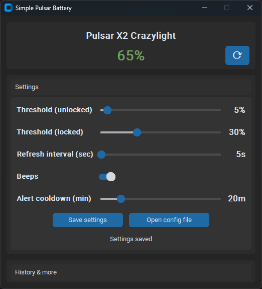

# Simple Pulsar Battery Notification

This is a small background tool that **notifies you via a Windows toast and
beeps** when your Pulsar X2 battery is low and **not charging**. It reads the
battery directly from the dongle using a vendor HID report.

Inspired by https://github.com/jonkristian/pulsar-x3-python/ - the key
takeaways were that the battery value lives at byte 6 of a vendor report and
that the dongle uses HID control/interrupt traffic for these queries.

## Screenshot



## Features

- Low-battery notifications (toast + beeps)
- Different thresholds when the PC is locked vs unlocked
- Tray icon with a small status/settings UI
- Click a toast to open the UI (when the app is running)
- Works with the Pulsar X2 Crazylight + dongle and X2 V1 + dongle

## Prerequisites

- Windows 10/11 (tested on Windows only)
- Python 3.8+

## Installation

### SIMPLE USAGE: Skip to the [Usage via Windows binary](#usage-via-windows-binary) section if you want to use the precompiled Windows executable file

1. Install dependencies:

   ```powershell
   pip install -r requirements.txt
   ```

2. (Optional) Set environment variables:

| Parameter                              | Description                                               |
| -------------------------------------- | --------------------------------------------------------- |
| `BATTERY_LEVEL_ALERT_THRESHOLD`        | Battery % threshold when unlocked (default: `5`)          |
| `BATTERY_LEVEL_ALERT_THRESHOLD_LOCKED` | Battery % threshold shortly after locking (default: `30`) |
| `LOG_LEVEL_ROOT`                       | Root logging level (default: `INFO`)                      |
| `LOG_LEVEL`                            | App logging level (default: `INFO`)                       |

## Usage via script

Run the notifier:

```powershell
python .\main.py
```

It runs in the tray. Left-click the tray icon to open the UI, right-click for
Exit.

One-off status toast:

```powershell
python .\main.py --once
```

Optional one-off battery check:

```powershell
python .\pulsar_battery_logger.py --once
```

Force a specific device backend:

```powershell
python .\pulsar_battery_logger.py --backend x2cl --once
python .\pulsar_battery_logger.py --backend x2v1 --once
```

## Usage via Windows binary

Simply run the executable file which you can download [here](https://github.com/Elehiggle/SimplePulsarBatteryNotification/releases)
(attention: Windows SmartScreen Defender may raise an alert, this is normal
since this is an unknown tool). It will silently run in the background and
notify you when your Pulsar device battery is low via notifications and beeps
at certain thresholds. Copy the file into your startup folder at
`%APPDATA%\Microsoft\Windows\Start Menu\Programs\Startup` to run it
automatically on startup. It will use the default variables (5% and 30% for
when the PC is locked).

```
%APPDATA%\Microsoft\Windows\Start Menu\Programs\Startup
```

One-off status toast:

```
SimplePulsarBatteryNotification.exe --once
```

## Building the Windows executable (PyInstaller)

```powershell
pip install -r requirements.txt

python -m PyInstaller --clean --noconfirm --onefile --windowed `
  --name "SimplePulsarBatteryNotification" `
  --icon icon.ico `
  --add-data "icon.png;." `
  --hidden-import "winrt.windows.foundation.collections" `
  --optimize 2 `
  --exclude-module unittest --exclude-module pydoc --exclude-module doctest `
  main.py
```

Output:

```text
dist\SimplePulsarBatteryNotification.exe
```

## Notes

- This is specifically for the Pulsar X2 Crazylight, with support for the X2 V1.
  I do not know if other models work yet. Pull requests are welcome.
- Battery readings can jump upward shortly after plugging in a charging cable
  and stay higher even after unplugging. The dongle appears to report a raw
  battery value that can lag or differ from the official software, so treat
  these readings as approximate and best for notifications rather than precise
  calibration.
- If the mouse is idle and the dongle stops responding, the notifier reuses the
  last successful reading for up to 10 minutes.
- Threshold settings are stored in
  `%APPDATA%\SimplePulsarBatteryNotification\settings.json`. The refresh
  interval (default 5 seconds) is configurable in the UI and saved there too.
  When using the Microsoft Store Python, `%APPDATA%` may resolve under
  `...\LocalCache\Roaming\SimplePulsarBatteryNotification`. You can use the
  "Open config file" button in the UI to jump to the active file.
- The detailed protocol research lives in `DETAILS.md`.
- The debug script is in `research\pulsar_x2_debug_logger.py`.

## Related Projects

Looking for a version with a nicer UI? Check out [PulsarBattery](https://github.com/darthsoup/PulsarBattery) - a C# implementation we're working on.

## Contributing

Contributions are welcome! If you find any issues or have suggestions for improvements, please open an issue or submit a pull request.

## License

This project is licensed under the MIT License.

